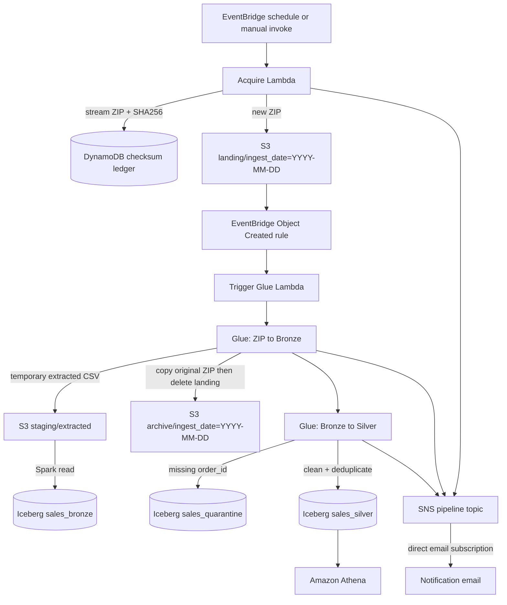

# IATA Case Study — Event-Driven AWS Data Pipeline

**Stack:** Lambda · EventBridge · S3 · Glue 4.0/Spark · Apache Iceberg · DynamoDB · SNS · Athena · Terraform

## Architecture



## Folder contract

| Prefix | Purpose | Retention |
|---|---|---|
| `landing/ingest_date=YYYY-MM-DD/` | Transient inbox for unprocessed ZIP files | Removed after successful archive; stale objects expire after 30 days |
| `archive/ingest_date=YYYY-MM-DD/` | Immutable original source ZIPs | Retained |
| `staging/extracted/checksum=.../` | Temporary extracted CSV used for the Spark read | Deleted by the job; lifecycle fallback expires it after 1 day |
| `bronze/` | Append-only Iceberg raw rows | Retained and governed by Iceberg |
| `silver/` | Current typed, deduplicated Iceberg dataset | Full-table overwrite without dropping the table |
| `quarantine/` | Current rows rejected for missing `order_id` | Full-table overwrite without repeated appends |

The old `raw/` and permanent `intermediate/` layout was incorrect. `landing/` is now an inbox, the original ZIP is moved to `archive/` only after bronze succeeds, and extracted CSVs are temporary.

## Review decisions

### Adaptive Query Execution

Glue 4.0 already enables Spark Adaptive Query Execution by default. The Terraform configuration sets it explicitly and enables post-shuffle coalescing with a 128 MiB advisory partition size. It is useful for the silver deduplication shuffle, but it is not a reason by itself to add workers.

Glue Auto Scaling is also enabled. `number_of_workers` is therefore the maximum, not a fixed allocation.

### Partitioning

- **Bronze:** unpartitioned. This table is append-only, scanned as a whole by the current silver job, and each source ZIP is already tracked by checksum and source file.
- **Silver:** Iceberg hidden partitioning by `years(order_date)`. For this 2-million-row dataset, the previous `(region, order_year)` identity partitioning created many small partitions. Region has low cardinality and remains available for file-statistics pruning.
- **Quarantine:** unpartitioned because it should remain small.
- **Archive:** S3 key partitioned by ingestion date for operational browsing and lifecycle management.

After upgrading an existing deployment, run `make reset-silver` once so the table is recreated with the new Iceberg partition specification.

### Duplicate count

The silver job now reports:

- bronze rows scanned;
- clean rows before deduplication;
- **duplicate rows removed**;
- rows written to silver;
- quarantine rows;
- synthetic region rows.

`duplicate rows removed = clean rows before deduplication - final silver rows`.

For a long-running production table, enable AWS Glue managed Iceberg compaction, snapshot retention, and orphan-file deletion after the tables exist. Those optimizers are intentionally not hard-coded here because table optimizer resources depend on deployment permissions and retention policy decisions.

## Repository tree

```text
.
├── Makefile
├── README.md
├── glue_jobs/
│   ├── bronze_to_silver.py
│   └── zip_to_bronze.py
├── lambdas/
│   ├── acquire/handler.py
│   └── trigger_glue_zip/handler.py
└── terraform/
    ├── environments/dev/
    ├── modules/
    │   ├── athena/
    │   ├── eventbridge/
    │   ├── glue/
    │   ├── iam/
    │   ├── lambda/
    │   ├── notifications/
    │   └── s3/
    └── iam_deploy_policy.json
```

## Configure

```bash
cp terraform/environments/dev/terraform.tfvars.example \
   terraform/environments/dev/terraform.tfvars
```

Edit the copied file:

```hcl
data_bucket_name           = "iata-lake"
athena_results_bucket_name = "iata-athena-results"
notification_email         = "you@example.com"
```

## Deploy

```bash
export AWS_PROFILE=iata-case-study
export AWS_DEFAULT_REGION=eu-central-1

make init
make fmt
make validate
make plan
make apply
```

Amazon SNS sends a subscription-confirmation email after the first apply. Open it and confirm the subscription before expecting pipeline emails.

## Run

```bash
source <(make env)
make acquire
make watch-bronze
make watch-silver
```

Manual landing test:

```bash
make drop-file FILE=./sales.zip
```

Operational checks:

```bash
make landing-list
make archive-list
make staging-list
make ledger-list
```

A healthy completed run normally leaves `landing/` and `staging/` empty and places the original ZIP under `archive/`.

## Validate in Athena

```sql
SELECT 'bronze' AS layer, COUNT(*) AS rows
FROM iata_lake.sales_bronze
UNION ALL
SELECT 'silver', COUNT(*)
FROM iata_lake.sales_silver
UNION ALL
SELECT 'quarantine', COUNT(*)
FROM iata_lake.sales_quarantine;
```

Check whether any duplicate `order_id` remains in silver:

```sql
SELECT order_id, COUNT(*) AS duplicate_count
FROM iata_lake.sales_silver
GROUP BY order_id
HAVING COUNT(*) > 1;
```
